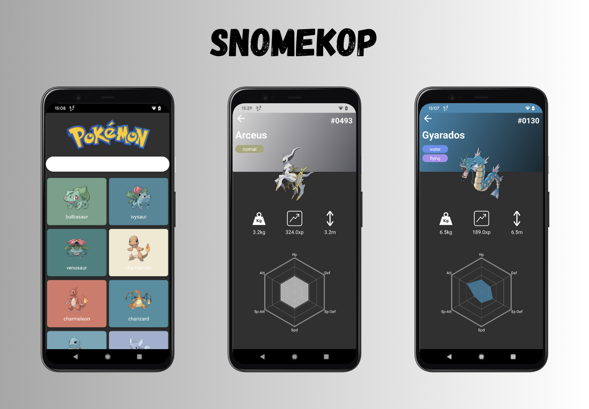

<h1 align="center"> Snomekop </h1>

  
Native Android Pokedex app using Jetpack compose, Hilt, Paging3, Retrofit and Room. MVVM Architecture

 

## Tech Stack & key libraries

- [Jetpack compose](https://developer.android.com/jetpack/compose): Fully declarative UI toolkit built using Kotlin (100% of the UI)
- [Kotlin Flows](https://kotlinlang.org/docs/flow.html): Observe data and UI state holders
- [Retrofit](https://square.github.io/retrofit/): Make API calls and easily turn the responses into POJO objects (__NOTE: Consider replacing Retrofit with Ktor to facilitate a smoother transition towards Kotlin Multiplatform (KMP).__)
- [Okhttp3](https://square.github.io/okhttp/): Actual http client used by Retrofit
- [Timber](https://github.com/JakeWharton/timber): Simple and straightforward logging library
- [Paging3](https://developer.android.com/topic/libraries/architecture/paging/v3-overview): Paging3 library streamlines the loading and display of paged data from various data sources, handling both local storage and network seamlessly
- [Kotlin Coroutines](https://kotlinlang.org/docs/coroutines-overview.html#tutorials): Lightweight, built-in tool in Kotlin for asynchronous programming and handling long-running tasks without blocking threads
- [Hilt](https://developer.android.com/training/dependency-injection/hilt-android): Dependency injection library for Android that simplifies and standardizes the process of integrating [Dagger](https://dagger.dev/) into Android apps
- [Coil](https://coil-kt.github.io/coil/compose/): Image loading library for Android backed by Kotlin Coroutines, focusing on simplicity and performance
- [Room](https://developer.android.com/jetpack/androidx/releases/room): Abstraction layer over SQLite, providing a robust database solution for Android apps with compile-time query verification and built-in migration support
- [Lifecycle](https://developer.android.com/jetpack/androidx/releases/lifecycle): A part of Android Jetpack that provides components to handle the Android app lifecycle, ensuring better organization and reduced boilerplate
- [Viewmodel](https://developer.android.com/topic/libraries/architecture/viewmodel): Android architecture component designed to store and manage UI-related data in a lifecycle-conscious way, preventing data loss during configuration changes.

 

## Public API

  <i>The most populat pokemon api.</i<>

